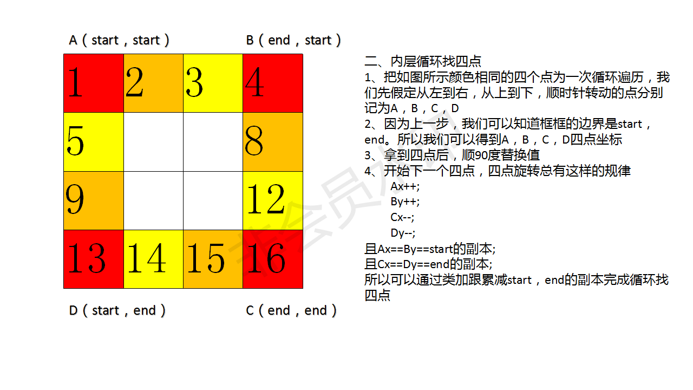

<script src="https://cdn.bootcss.com/mathjax/2.7.7/MathJax.js?config=TeX-AMS-MML_HTMLorMML"></script>

## 0048. 旋转图像

给定一个 n × n 的二维矩阵表示一个图像。

将图像顺时针旋转 90 度。

说明：

你必须在**原地**旋转图像，这意味着你需要直接修改输入的二维矩阵。**请不要**使用另一个矩阵来旋转图像。

不占用额外内存空间能否做到？


示例 1:

给定 matrix =

```
[
  [1,2,3],
  [4,5,6],
  [7,8,9]
],
```

原地旋转输入矩阵，使其变为:

```
[
  [7,4,1],
  [8,5,2],
  [9,6,3]
]
```

示例 2:

给定 matrix =

```
[
  [ 5, 1, 9,11],
  [ 2, 4, 8,10],
  [13, 3, 6, 7],
  [15,14,12,16]
], 
```

原地旋转输入矩阵，使其变为:

```
[
  [15,13, 2, 5],
  [14, 3, 4, 1],
  [12, 6, 8, 9],
  [16, 7,10,11]
]
```

来源：力扣（LeetCode）
链接：https://leetcode-cn.com/problems/rotate-matrix-lcci
著作权归领扣网络所有。商业转载请联系官方授权，非商业转载请注明出处。


### 代码模板

``` java
class Solution {
    public void rotate(int[][] matrix) {

    }
}
```

#### 1. 旋转四个矩形


[旋转四个矩形](qu0048/solu1/Solution.java)


#### 2. 在单次循环中旋转 4 个矩形

[在单次循环中旋转 4 个矩形](qu0048/solu2/Solution.java)


#### 4. 旋转外框




[旋转外框](qu0048/solu3/Solution.java)


#### 3. 翻转实现旋转

顺时针转90度  => 先上下翻转，再左上右下对角翻转

逆时针转90度  => 先上下翻转，再左下右上对角翻转

旋转180度 => 先上下翻转，再左右翻转

[翻转实现旋转](qu0048/solu4/Solution.java)
