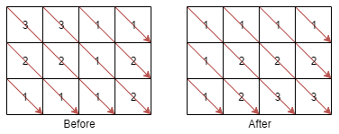

<script src="https://cdn.bootcss.com/mathjax/2.7.7/MathJax.js?config=TeX-AMS-MML_HTMLorMML"></script>

## 1329. 将矩阵按对角线排序

### 问题描述

给你一个 m * n 的整数矩阵 mat ，请你将同一条对角线上的元素（从左上到右下）按升序排序后，返回排好序的矩阵。

 
示例 1：



```
输入：mat = [[3,3,1,1],[2,2,1,2],[1,1,1,2]]
输出：[[1,1,1,1],[1,2,2,2],[1,2,3,3]]
```

提示：

* m == mat.length
* n == mat[i].length
* 1 <= m, n <= 100
* 1 <= mat[i]\[j] <= 100

来源：力扣（LeetCode）
链接：https://leetcode-cn.com/problems/sort-the-matrix-diagonally
著作权归领扣网络所有。商业转载请联系官方授权，非商业转载请注明出处。

### 模板代码

``` java
class Solution {
    public int[][] diagonalSort(int[][] mat) {

    }
}
```

### 解决方案

#### 1. 聚类缓存并排序

使用辅助数组，数组索引为`r-c+(cols-1)`，数组元素使用优先级队列。

最后构造答案并返回即可。

[聚类缓存并排序](qu1329/solu1/Solution.java)


#### 2. 直接排序

确定起点；

由元素mat[r]\[c]，确定下一个元素mat[r+1]\[c+1]，注意边界即可。

[直接排序](qu1329/solu2/Solution.java)