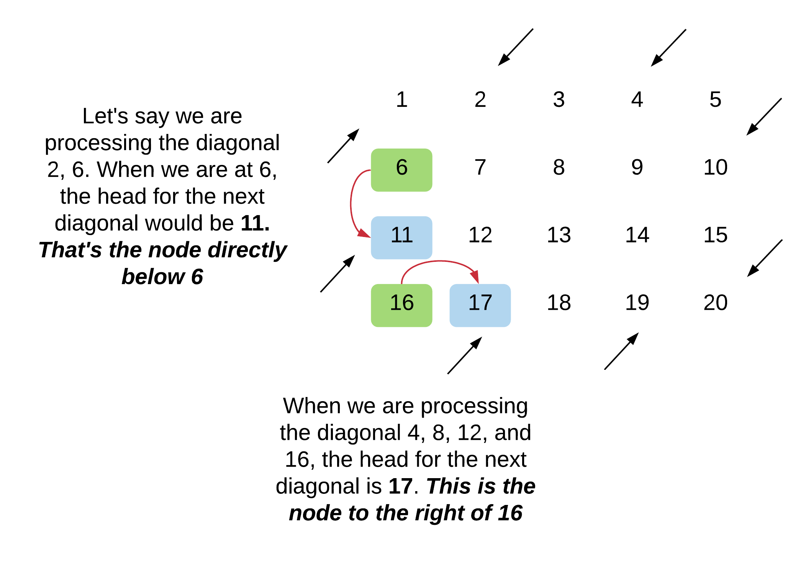
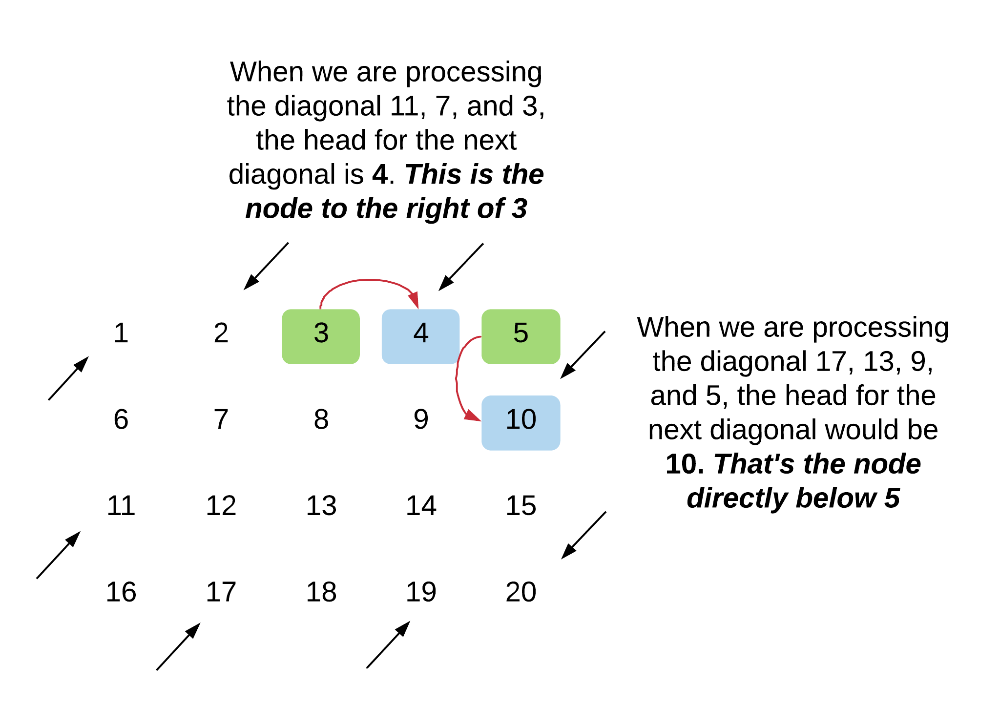

<script src="https://cdn.bootcss.com/mathjax/2.7.7/MathJax.js?config=TeX-AMS-MML_HTMLorMML"></script>

## 0498. 对角线遍历


### 问题描述

给定一个含有 M x N 个元素的矩阵（M 行，N 列），请以对角线遍历的顺序返回这个矩阵中的所有元素，对角线遍历如下图所示。

 

示例:

```
输入:
[
 [ 1, 2, 3 ],
 [ 4, 5, 6 ],
 [ 7, 8, 9 ]
]

输出:  [1,2,4,7,5,3,6,8,9]
```

解释:


说明:

* 给定矩阵中的元素总数不会超过 100000 。

来源：力扣（LeetCode）
链接：https://leetcode-cn.com/problems/diagonal-traverse
著作权归领扣网络所有。商业转载请联系官方授权，非商业转载请注明出处。

### 模板代码

``` java
class Solution {
    public int[] findDiagonalOrder(int[][] matrix) {

    }
}
```

### 解决方案


#### 1. 数组聚类和翻转

[数组聚类和翻转](qu0498/solu1/Solution.java)


#### 2. 对角线迭代和翻转

1. 初始化数组 ans，存储最后结果。

2. 外层循环遍历所有的对角线。第一行和最后一列的元素都是对角线的起点。

3. 内层 while 循环遍历对角线上的所有元素。可以计算指定对角线上的元素数量，也可以简单迭代直到索引超出范围。

4. 因为不知道每条对角线上的元素数量，需要为每条对角线分配一个列表或动态数组。但是同样也可以通过计算得到当前对角线上的元素数量。

5. 对于奇数编号的对角线，只需要将迭代结果翻转再加入结果数组即可。

[对角线迭代和翻转](qu0498/solu2/Solution.java)


#### 3. 模拟遍历过程（推荐）

对每条对角线需要明确两件事情：

* 确定对角线的行走方向。

* 确定对角线的起点元素，这取决于对角线的行走方向。

##### 确定对角线的行走方向

只需要设置一个布尔型变量，保持交替，就可以确定对角线方向。


##### 确定对角线的起点元素

我们已经知道上一个对角线的终点，可以以此来确定下一条对角线的起点。

位于向下行走对角线终点时，找出下一个向上行走对角线起点有两种情况。



找出向上行走对角线起点需要遵循两个规则：

> 如果当前终点不在矩阵最后一行，则下一个对角线的起点是当前终点的正下方元素；否则，下一条对角线起点是当前终点的右边元素。


位于向上行走对角线终点时，找出下一个向上行走对角线起点有两种情况。



找出向下行走对角线起点需要遵循两个规则：

> 如果当前终点不在矩阵最后一行，下一条对角线的起点是当前终点正下方元素；否则，下一条对角线起点是当前终点的右边元素。


##### 算法

1. 初始化一个布尔变量 direction 表示当前对角线的方向。根据当前方向和终点位置确定下一条对角线起点。最初 direction 为 1，方向向上。每条对角线遍历完成后更新 direction。

2. 假设当前对角线起点为\\(matrix[i]\[j\]\\)，根据方向遍历该对角线。

    * 向上的对角线，下一个元素是 \\(matrix[i - 1]\[j + 1\]\\)。
    * 向下的对角线，下一个元素是 \\(matrix[i + 1]\[j - 1\]\\)。

3. 遍历当前对角线元素直到到达矩阵边界。

4. 假设现在到达当前对角线的终点，寻找下一条对角线起点。

5. 继续处理对角线元素，当前对角线遍历结束时，使用当前方向和终点位置找出下一条对角线起点。然后翻转方向，处理下一条对角线。

[模拟遍历过程](qu0498/solu3/Solution.java)

