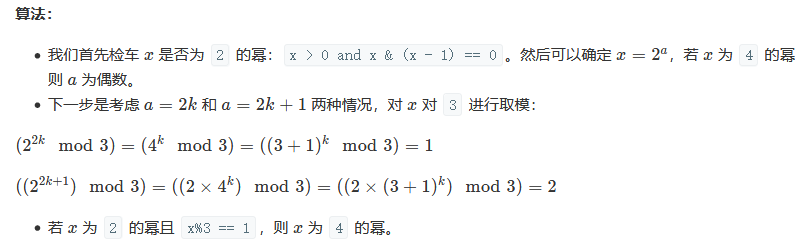
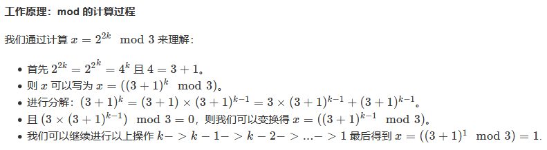

<script src="https://cdn.bootcss.com/mathjax/2.7.7/MathJax.js?config=TeX-AMS-MML_HTMLorMML"></script>

## 0342. 4的幂


### 问题描述

给定一个整数 (32 位有符号整数)，请编写一个函数来判断它是否是 4 的幂次方。

示例 1:

输入: 16
输出: true

示例 2:

输入: 5
输出: false

进阶：
你能不使用循环或者递归来完成本题吗？

来源：力扣（LeetCode）
链接：https://leetcode-cn.com/problems/power-of-four
著作权归领扣网络所有。商业转载请联系官方授权，非商业转载请注明出处。

### 模板代码

``` java

```

### 解决方案

#### 1. 循环取模


#### 2. 暴力穷举


#### 3. 换底公式

**注意精度问题**


#### 4. 位运算（推荐）

确定是2的幂，也就是只有一个位有1。 `n & (n-1) == 0`

确定有1的位，在正确的位置上。 `n & 0x55555555 == n`

#### 5. 位运算 + 数学（推荐）

假设x是2的幂。那么，如果 `x%3==1`，则 x 也是4的幂，如果`x%3==2`，则x不是4的幂。






