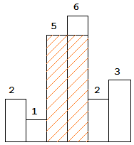

<script src="https://cdn.bootcss.com/mathjax/2.7.7/MathJax.js?config=TeX-AMS-MML_HTMLorMML"></script>

## 0084. 柱状图中最大的矩形

[刷题](qu0084/solu/Solution.java)

### 问题描述

给定 `n` 个 **非负整数**，用来表示柱状图中各个柱子的高度。每个柱子彼此相邻，且宽度为 `1` 。

求在该柱状图中，能够勾勒出来的矩形的最大面积。


以上是柱状图的示例，其中每个柱子的宽度为 1，给定的高度为 `[2,1,5,6,2,3]`。

 

图中阴影部分为所能勾勒出的最大矩形面积，其面积为 `10` 个单位。

示例:

```
输入: [2,1,5,6,2,3]
输出: 10
```

来源：力扣（LeetCode）
链接：https://leetcode-cn.com/problems/largest-rectangle-in-histogram
著作权归领扣网络所有。商业转载请联系官方授权，非商业转载请注明出处。

### 模板代码

``` java
class Solution {
    public int largestRectangleArea(int[] heights) {

    }
}
```

### 解决方案

矩形面积 = 高度 * 宽度；

宽度 = 右边界 - (左边界 - 1)

#### 1. 枚举宽度

**枚举所有可能的矩形**

枚举所有起点，确定起点后，枚举所有终点，确定起点和终点后，就确定了宽度，然后求高度，最后求面积。

##### 暴力求高度

确定矩形宽度\\(\mathrm{O}(n^2)\\)，求高度\\(\mathrm{O}(n)\\)，再求面积\\(\mathrm{O}(n^3)\\)。

对于两个柱子间矩形，宽为它们之间的距离`disc`，高为它们之间最矮柱子的高度`min`，面积为`min*disc`。

[枚举宽度：暴力求高度](qu0084/solu1/Solution.java)

时间复杂度：\\(\mathrm{O}(n^3)\\)；空间复杂度：\\(\mathrm{O}(1)\\)

##### DP求高度

优化方案1。

\\(dp(n)\\) 表示矩形 `[?, n]` 的高度。 

$$
dp(n) = \min\big(dp(n-1), heights_n\big)
$$

[枚举宽度：DP求高度](qu0084/solu2/Solution.java)

时间复杂度：\\(\mathrm{O}(n^2)\\)；空间复杂度：\\(\mathrm{O}(1)\\)


#### 2. 枚举高度

**以某一柱子 i 的高度 heights[i] 为高，求出其尽可能大的矩形面积。**

##### 暴力求宽度

确定矩形高度\\(\mathrm{O}(n)\\)，求宽度\\(\mathrm{O}(n)\\)，再求面积\\(\mathrm{O^2}(n)\\)。

以某一柱子的高度作为高，要得出尽可能大的矩形面积，需要先定位相应的最左边界、最右边界。

对于某一柱子，其最左边界就是向左看，就一个比它小的柱子右面的那根柱子；其最右边界就是向右看，第一个比它小的柱子左面的那根柱子。

[枚举高度：暴力求宽度](qu0084/solu3/Solution.java)

时间复杂度：\\(\mathrm{O}(n^2)\\)；空间复杂度：\\(\mathrm{O}(1)\\)

##### 单调栈求宽度（推荐）

优化暴力求解2方案2。

我们可以将三次遍历化简成一次遍历，并只使用一个辅助单调栈。

从左向右遍历，使用严格单调递增栈`helper`，缓存柱子高度。

> 注意，相邻的相同的柱子高度是不能跳过的。

因为栈`helper`是严格单调递增的，所以柱子`helper[top]`的最左开边界就是柱子`helper[top-1]`。

我们只需要再定位最右边界即可。前面已经说过，最右边界就是向右看，第一个比它小的柱子左面的那根柱子。

[枚举高度：单调栈求宽度](qu0084/solu4/Solution.java)

时间复杂度：\\(\mathrm{O}(n)\\)。 n 个数字每个会被压栈弹栈各一次。

空间复杂度： \\(\mathrm{O}(n)\\)。用来存放栈中元素。


#### 3. 分治算法

##### 简单实现

通过观察，可以发现，最大面积矩形存在于以下几种情况：

1. 以最矮柱子为高，以尽可能往两边延伸为宽的矩形

2. 在最矮柱子左边的最大面积矩形（子问题）。

3. 在最矮柱子右边的最大面积矩形（子问题）。


举个例子：

```
[6, 4, 5, 2, 4, 3, 9]
```

这里最矮柱子高度为 2 。以 2 为高的最大子矩阵面积是 2x7=14 。现在，我们考虑上面提到的第二种和第三种情况。我们对高度为 2 柱子的左边和右边采用同样的过程。在 2 的左边， 4 是最小的，形成区域为 4x3=12 。将左边区域再继续分，矩形的面积分别为 6x1=6 和 5x1=5 。同样的，我们可以求出右边区域的面积为 3x3=9, 4x1=4 和 9x1=9 。因此，我们得到最大面积是 16 。具体过程可参考下图：


[分治算法：简单实现](qu0084/solu6/Solution.java)

[分治算法：简单优化](qu0084/solu7/Solution.java)

时间复杂度：

平均开销：\\(\mathrm{O}(n \cdot \log n)\\)

最坏情况：\\(\mathrm{O}(n^2)\\)

空间复杂度：\\(\mathrm{O}(n)\\)。最坏情况下递归需要\\(\mathrm{O}(n)\\) 的空间。


##### 分治算法改进（推荐）

用线段树代替遍历来找到区间最小值。单词查询复杂度就变成了\\(\mathrm{O}(\log ⁡  n)\\)


