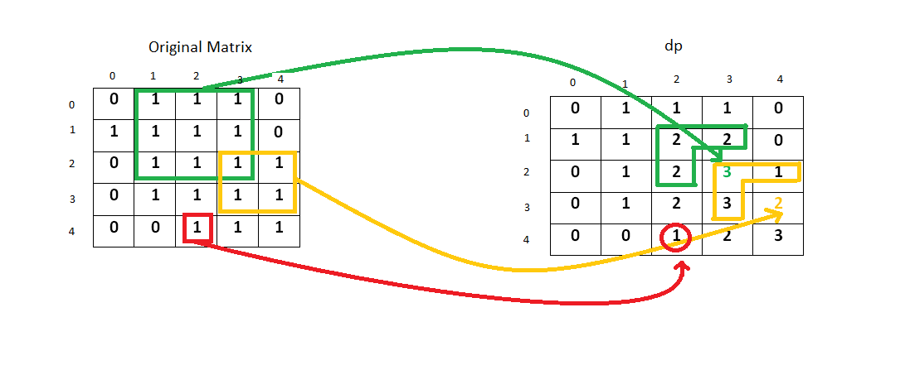

<script src="https://cdn.bootcss.com/mathjax/2.7.7/MathJax.js?config=TeX-AMS-MML_HTMLorMML"></script>

## 0221.最大正方形

[刷题](qu0221/solu/Solution.java)

与 [1277.统计全为 1 的正方形子矩阵](../../contest/weekly/c165/1277.统计全为 1 的正方形子矩阵.md) 相似。

### 问题描述

在一个由 `0` 和 `1` 组成的二维矩阵内，找到只包含 `1` 的最大正方形，并返回其面积。

示例:

输入: 

```
1 0 1 0 0
1 0 1 1 1
1 1 1 1 1
1 0 0 1 0

输出: 4
```

来源：力扣（LeetCode）
链接：https://leetcode-cn.com/problems/maximal-square
著作权归领扣网络所有。商业转载请联系官方授权，非商业转载请注明出处。


### 模板代码

``` java
class Solution {
    public int maximalSquare(char[][] matrix) {

    }
}
```

### 解决方案

#### 1. 暴力求解

##### 暴力枚举（基本实现）

枚举每个可能的正方形。

以一个元素作为左上顶点，另一个元素为右下顶点，构造正方形。

判断正方形内所有元素是否都是`1`。

如果是，则求其面积，并更新最大正方形面积。

时间复杂度：\\(\mathrm{O}(m^3 \cdot n^3)\\)，最坏情况下，我们需要遍历整个矩阵寻找每个 1。

空间复杂度：\\(\mathrm{O}(1)\\)，没有使用额外的空间。

##### 暴力枚举（优化）

优化方案1。

* 左上顶点，以`1`开始，遇`0`跳过。
* 右下顶点，向右下走，遇`0`结束，换一个左上顶点；遇到`1`，判断正方形内其它元素是否为`1`。
* `ans`记录能够得到的正方形边长，忽略掉可能存在的较小正方形的情况。左上顶点[i,j]，`i>N-ans`或`j>N-ans`。

时间复杂度：\\(\mathrm{O}(m^2 \cdot n^2)\\)，最坏情况下，我们需要遍历整个矩阵寻找每个 1。

空间复杂度：\\(\mathrm{O}(1)\\)，没有使用额外的空间。

[代码实现](qu0221/solu1/Solution.java)


#### 2. 动态规划

**找出最优子结构**

##### 动态规划（基本实现）



\\(dp(i,j)\\) 表示以 \\((i, j)\\) 为右下角，且只包含 `1` 的正方形的边长最大值。

$$
dp(i,j) = 
\begin{cases}
0, & matrix[i]\[j] = 0 \\\\
matrix[i]\[j], & i = 0 \lor j = 0 \\\\
\min(dp(i-1,j-1), dp(i-1, j), dp(i, j-1)) + 1, & 其它
\end{cases}
$$

时间复杂度：\\(\mathrm{O}(m \cdot n)\\)。

空间复杂度：\\(\mathrm{O}(m \cdot n)\\)，用了一个大小相同的矩阵 dp。


##### 动态规划：状态压缩

在方案2的基础上，进行优化，减小空间复杂度


时间复杂度：\\(\mathrm{O}(m \cdot n)\\)

空间复杂度：\\(\mathrm{O}(n)\\)，使用了一个一维数组 dp。


[动态规划：状态压缩](qu0221/solu2/Solution.java)