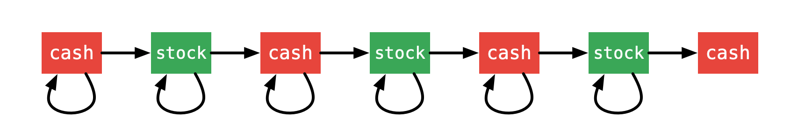

<script src="https://cdn.bootcss.com/mathjax/2.7.7/MathJax.js?config=TeX-AMS-MML_HTMLorMML"></script>

## 0122. 买卖股票的最佳时机II

给定一个数组，它的第 i 个元素是一支给定股票第 i 天的价格。

设计一个算法来计算你所能获取的最大利润。你可以尽可能地完成更多的交易（多次买卖一支股票）。

注意：你不能同时参与多笔交易（你必须在再次购买前出售掉之前的股票）。

 

示例 1:

```
输入: [7,1,5,3,6,4]
输出: 7
解释: 在第 2 天（股票价格 = 1）的时候买入，在第 3 天（股票价格 = 5）的时候卖出, 这笔交易所能获得利润 = 5-1 = 4 。
     随后，在第 4 天（股票价格 = 3）的时候买入，在第 5 天（股票价格 = 6）的时候卖出, 这笔交易所能获得利润 = 6-3 = 3 。
```

示例 2:

```
输入: [1,2,3,4,5]
输出: 4
解释: 在第 1 天（股票价格 = 1）的时候买入，在第 5 天 （股票价格 = 5）的时候卖出, 这笔交易所能获得利润 = 5-1 = 4 。
     注意你不能在第 1 天和第 2 天接连购买股票，之后再将它们卖出。
     因为这样属于同时参与了多笔交易，你必须在再次购买前出售掉之前的股票。
```

示例 3:

```
输入: [7,6,4,3,1]
输出: 0
解释: 在这种情况下, 没有交易完成, 所以最大利润为 0。
```


提示：

* \\(1 \leq prices.length \leq 3 * 10^4\\)
* \\(0 \leq prices[i] \leq 10^4\\)


来源：力扣（LeetCode）
链接：https://leetcode-cn.com/problems/best-time-to-buy-and-sell-stock-ii
著作权归领扣网络所有。商业转载请联系官方授权，非商业转载请注明出处。


### 模板代码

``` java
class Solution {
    public int maxProfit(int[] prices) {
        
    }
}
```

### 解决方案

#### 1. 暴力搜索

尝试所有可能组合

[暴力搜索](qu0122/solu1/Solution.java)


#### 2. 贪心算法（推荐）

一次遍历即可

[贪心算法](qu0122/solu2/Solution.java)

#### 3. 动态规划

$$
\begin{aligned}
profits_n = 
\begin{cases}
0,    & n=0 \\\\
\max\left((profits_{n-1} + (prices_n - price_{n-1})), profits_{n-1}\right), & n>0
\end{cases}
\end{aligned}
$$

一次遍历即可

##### 状态转移方程

设置一个二维矩阵表示状态

第 1 步：定义状态

状态 `dp[i][j]` 定义如下

第一维 i 表示索引为 i 的那一天（具有前缀性质，即考虑了之前天数的收益）能获得的最大利润；

第二维 j 表示索引为 i 的那一天是持有股票，还是持有现金。这里 0 表示持有现金（cash），1 表示持有股票（stock）。

第 2 步：思考状态转移方程

状态从持有现金（cash）开始，到最后一天我们关心的状态依然是持有现金（cash）；

每一天状态可以转移，也可以不动。状态转移用下图表示：



$$
dp[i]\[0] = \max(dp[i-1]\[0], dp[i-1]\[1] + prices[i]) \\\\
dp[i]\[1] = \max(dp[i-1]\[1], dp[i-1]\[0] - prices[i])
$$

说明：

因为不限制交易次数，除了最后一天，每一天的状态可能不变化，也可能转移；

写代码的时候，可以不用对最后一天单独处理，输出最后一天，状态为 0 的时候的值即可。

第 3 步：确定起始

起始的时候：

如果什么都不做，dp[0]\[0] = 0；

如果买入股票，当前收益是负数，即 dp[0]\[1] = -prices[i]；

第 4 步：确定终止

终止的时候，上面也分析了，输出 `dp[len - 1][0]`，因为一定有` dp[len - 1][0] > dp[len - 1][1]`。


##### 状态压缩

[状态压缩](qu0122/solu3/Solution.java)

作者：liweiwei1419
链接：https://leetcode-cn.com/problems/best-time-to-buy-and-sell-stock-ii/solution/tan-xin-suan-fa-by-liweiwei1419-2/
来源：力扣（LeetCode）
著作权归作者所有。商业转载请联系作者获得授权，非商业转载请注明出处。

