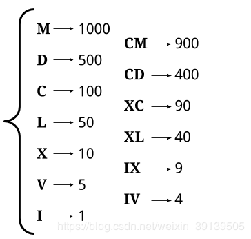

<script src="https://cdn.bootcss.com/mathjax/2.7.7/MathJax.js?config=TeX-AMS-MML_HTMLorMML"></script>

## 0012. 整数转罗马数字

[刷题](qu0012/solu/Solution.java)

### 问题描述

罗马数字包含以下七种字符： I， V， X， L，C，D 和 M。

```
字符          数值
I             1
V             5
X             10
L             50
C             100
D             500
M             1000
```

例如， 罗马数字 2 写做 `II` ，即为两个并列的 `I`。12 写做 `XII` ，即为 `X + II` 。 27 写做  `XXVII`, 即为 `XX + V + II` 。

通常情况下，罗马数字中小的数字在大的数字的右边。但也存在特例，例如 4 不写做 `IIII`，而是 `IV`。数字 1 在数字 5 的左边，所表示的数等于大数 5 减小数 1 得到的数值 4 。同样地，数字 9 表示为 `IX`。这个特殊的规则只适用于以下六种情况：

* I 可以放在 V (5) 和 X (10) 的左边，来表示 4 和 9。
* X 可以放在 L (50) 和 C (100) 的左边，来表示 40 和 90。 
* C 可以放在 D (500) 和 M (1000) 的左边，来表示 400 和 900。

给定一个整数，将其转为罗马数字。输入确保在 1 到 3999 的范围内。

示例 1:

```
输入: 3
输出: "III"
```

示例 2:

```
输入: 4
输出: "IV"
```

示例 3:

```
输入: 9
输出: "IX"
```

示例 4:

```
输入: 58
输出: "LVIII"
解释: L = 50, V = 5, III = 3.
```

示例 5:

```
输入: 1994
输出: "MCMXCIV"
解释: M = 1000, CM = 900, XC = 90, IV = 4.
```

来源：力扣（LeetCode）
链接：https://leetcode-cn.com/problems/integer-to-roman
著作权归领扣网络所有。商业转载请联系官方授权，非商业转载请注明出处。


### 模板代码

``` java
class Solution {
    public String intToRoman(int num) {
        
    }
}
```

### 解决方案

罗马数字由 7 个单字母符号组成，每个符号都有自己的价值。此外，减法规则（如问题描述中所述）给出了额外的 6 个符号。这给了我们总共 13 个独特的符号（每个符号由 1 个字母或 2 个字母组成）。



#### 1. 查字典

构造二维数组字典，查字典

每字反转+整体反转

[代码实现](qu0012/solu1/Solution.java)

#### 2. 贪心算法（推荐）

[贪心算法](qu0012/solu2/Solution.java)

#### 3. 硬编码数字
