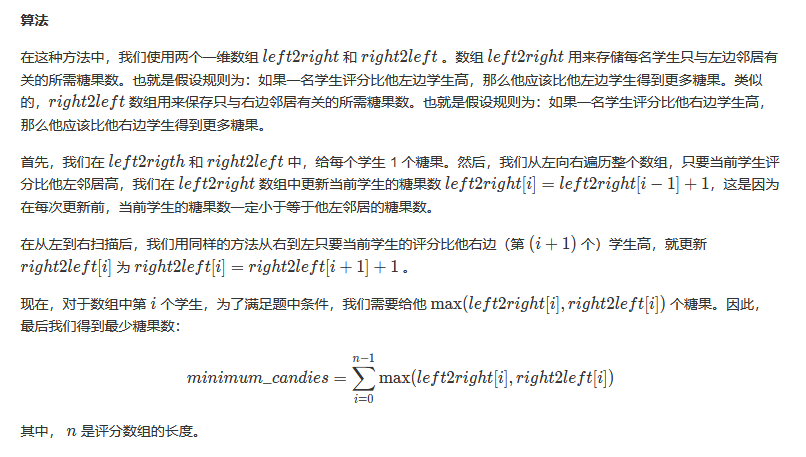
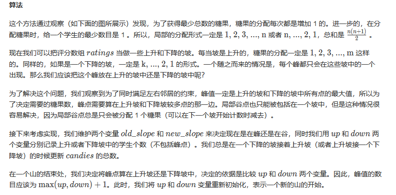
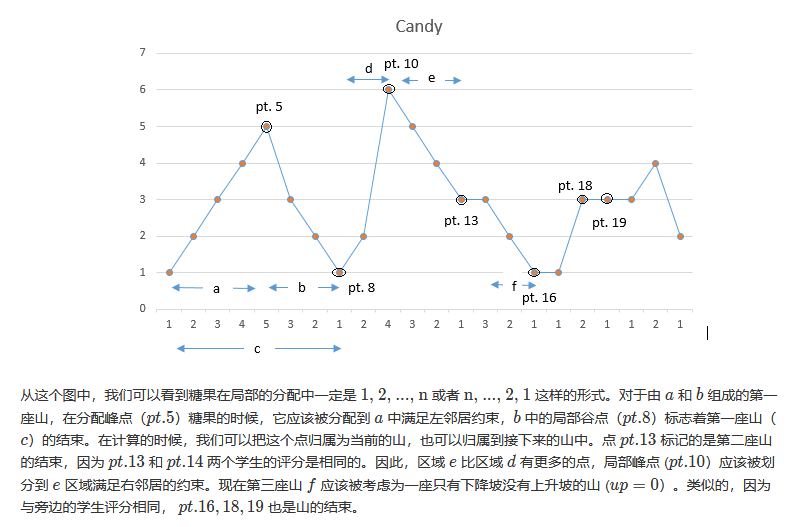

<script src="https://cdn.bootcss.com/mathjax/2.7.7/MathJax.js?config=TeX-AMS-MML_HTMLorMML"></script>

## 0135. 分发糖果（按评分分糖果）

[2刷](qu0135/solu/Solution.java)

### 问题描述

老师想给孩子们分发糖果，有 N 个孩子站成了一条直线，老师会根据每个孩子的表现，预先给他们评分。

你需要按照以下要求，帮助老师给这些孩子分发糖果：

* 每个孩子至少分配到 1 个糖果。
* 相邻的孩子中，评分高的孩子必须获得更多的糖果。

那么这样下来，老师 **至少** 需要准备多少颗糖果呢？

示例 1:

```
输入: [1,0,2]
输出: 5
```
解释: 你可以分别给这三个孩子分发 2、1、2 颗糖果。


示例 2:

```
输入: [1,2,2]
输出: 4
```
解释: 你可以分别给这三个孩子分发 1、2、1 颗糖果。
     第三个孩子只得到 1 颗糖果，这已满足上述两个条件。

来源：力扣（LeetCode）
链接：https://leetcode-cn.com/problems/candy
著作权归领扣网络所有。商业转载请联系官方授权，非商业转载请注明出处。


### 模板代码

``` java
class Solution {
    public int candy(int[] ratings) {

    }
}
```

### 解决方案


#### 1. 暴力求解

初始化，让每个孩子都分到 1 颗糖果。

遍历，每步都让当前孩子与前后相邻的两个孩子比较，判断当前孩子是否满足“评分高则分得更多糖果”的要求。如果不满足，则给当前孩子补发糖果。

循环遍历，直到某轮遍历没有补发糖果。


时间复杂度：\\(\mathrm{O}(n^2)\\)。对于每个元素，我们最多要遍历 \\(n\\) 次。

空间复杂度：\\(\mathrm{O}(n)\\) 。需要一个长度为 \\(n\\) 的 \\(candies\\) 数组。

[暴力求解：补发糖果](qu0135/solu1/Solution.java)


#### 2. 辅助数组

##### 两个辅助数组



1. 先分给孩子每人一块糖。
2. 从左到右遍历，通过贪心原则，使所有孩子满足左规则；
3. 从右到左遍历，通过贪心原则，使所有孩子满足右规则；
4. 取左右最大值作为糖数量，使所有孩子都同时满足左右规则。

时间复杂度：\\(\mathrm{O}(n)\\)。

空间复杂度：\\(\mathrm{O}(n)\\)。

[两个辅助数组](qu0135/solu2/Solution.java)


##### 一个辅助数组

优化方案2。

时间复杂度：\\(\mathrm{O}(n)\\)。

空间复杂度：\\(\mathrm{O}(n)\\)。

[一个辅助数组](qu0135/solu3/Solution.java)


#### 4. 常数空间（推荐）





时间复杂度：\\(\mathrm{O}(n)\\)。

空间复杂度：\\(\mathrm{O}(1)\\)。

[常数空间](qu0135/solu4/Solution.java)
