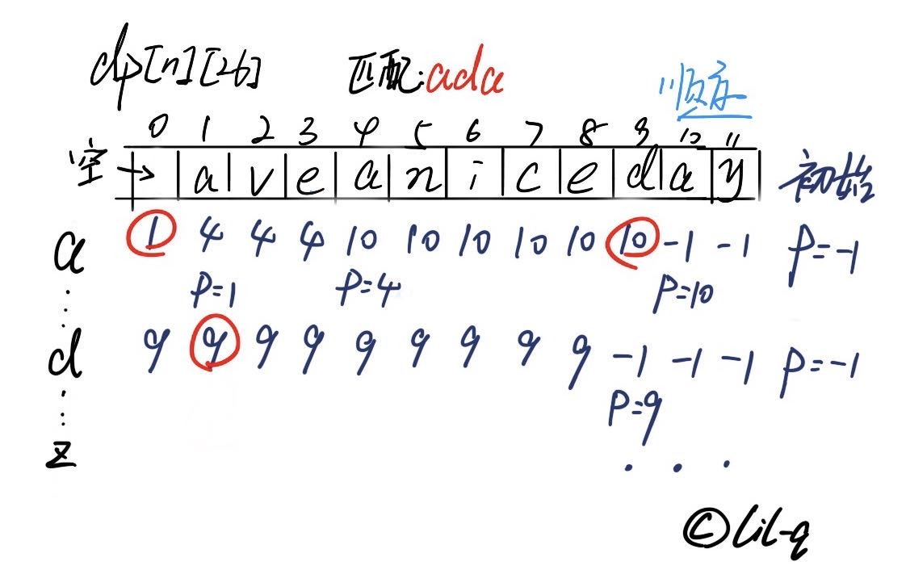

## 0392. 判断子序列

<script src="https://cdn.bootcss.com/mathjax/2.7.7/MathJax.js?config=TeX-AMS-MML_HTMLorMML"></script>

[2刷](qu0392/solu/Solution.java)

### 问题描述

给定字符串 s 和 t ，判断 s 是否为 t 的子序列。

你可以认为 s 和 t 中仅包含英文小写字母。字符串 t 可能会很长（长度 ~= 500,000），而 s 是个短字符串（长度 <=100）。

字符串的一个**子序列**是原始字符串删除一些（也可以不删除）字符而不改变剩余字符相对位置形成的新字符串。（例如，"ace"是"abcde"的一个子序列，而"aec"不是）。

示例 1:

```
s = "abc", t = "ahbgdc"

返回 true.
```

示例 2:

```
s = "axc", t = "ahbgdc"

返回 false.
```

后续挑战 :

* 如果有大量输入的 S，称作S1, S2, ... , Sk 其中 k >= 10亿，你需要依次检查它们是否为 T 的子序列。在这种情况下，你会怎样改变代码？

来源：力扣（LeetCode）
链接：https://leetcode-cn.com/problems/is-subsequence
著作权归领扣网络所有。商业转载请联系官方授权，非商业转载请注明出处。

### 模板代码

``` java
class Solution {
    public boolean isSubsequence(String s, String t) {

    }
}
```

### 解决方案

#### 1. 同步迭代

[同步迭代](qu0392/solu1/Solution.java)

时间复杂度：\\(\mathcal{O}(N)\\)。 N 是长串 t 的长度。

空间复杂度：\\(\mathcal{O}(1)\\)

#### 2. 二维辅助数组（进阶）

二维辅助数组，记录每个位置的下一个要匹配的字符的位置。然后，跳跃遍历。



[二维辅助数组](qu0392/solu2/Solution.java)

时间复杂度：\\(\mathcal{O}(M)\\)。 M 是短串 s 的长度。

空间复杂度：\\(\mathcal{O}(N)\\)。 N 是长串 t 的长度。

