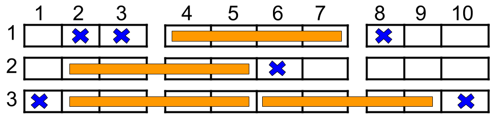

<script src="https://cdn.bootcss.com/mathjax/2.7.7/MathJax.js?config=TeX-AMS-MML_HTMLorMML"></script>

## 1386. 安排电影院座位

### 问题描述


如上图所示，电影院的观影厅中有 n 行座位，行编号从 1 到 n ，且每一行内总共有 10 个座位，列编号从 1 到 10 。

给你数组 reservedSeats ，包含所有已经被预约了的座位。比如说，researvedSeats[i]=[3,8] ，它表示第 3 行第 8 个座位被预约了。

请你返回 最多能安排多少个 4 人家庭 。4 人家庭要占据 同一行内连续 的 4 个座位。隔着过道的座位（比方说 [3,3] 和 [3,4]）不是连续的座位，但是如果你可以将 4 人家庭拆成过道两边各坐 2 人，这样子是允许的。

 

示例 1：



```
输入：n = 3, reservedSeats = [[1,2],[1,3],[1,8],[2,6],[3,1],[3,10]]
输出：4
解释：上图所示是最优的安排方案，总共可以安排 4 个家庭。蓝色的叉表示被预约的座位，橙色的连续座位表示一个 4 人家庭。
```

示例 2：

```
输入：n = 2, reservedSeats = [[2,1],[1,8],[2,6]]
输出：2
```

示例 3：

```
输入：n = 4, reservedSeats = [[4,3],[1,4],[4,6],[1,7]]
输出：4
```

提示：

* \\(1 \leq n \leq 10^9\\)
* \\(1 \leq reservedSeats.length \leq min(10*n, 10^4)\\)
* \\(reservedSeats[i].length == 2\\)
* \\(1 \leq reservedSeats[i]\[0] \leq n\\)
* \\(1 \leq reservedSeats[i]\[1] \leq 10\\)
* 所有 reservedSeats[i] 都是互不相同的。

来源：力扣（LeetCode）
链接：https://leetcode-cn.com/problems/cinema-seat-allocation
著作权归领扣网络所有。商业转载请联系官方授权，非商业转载请注明出处。

### 模板代码

``` java
class Solution {
    public int maxNumberOfFamilies(int n, int[][] reservedSeats) {

    }
}
```

### 解决方案

位运算

时间复杂度：\\(\mathrm{O}(r)\\)。 其中r是数组reservedSeats的长度。

空间复杂度：\\(\mathrm{O}(r)\\)。

[简单解决](qu1386/solu1/Solution.java)

[代码简化](qu1386/solu2/Solution.java)