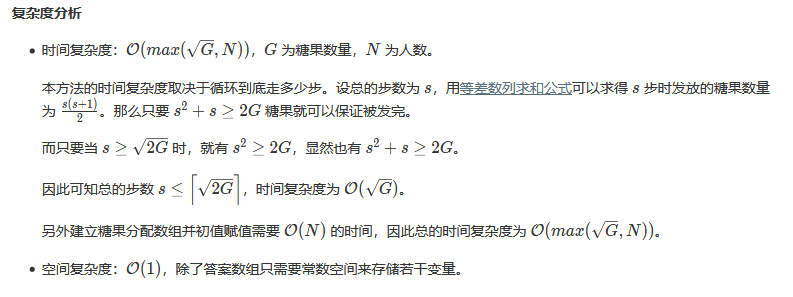
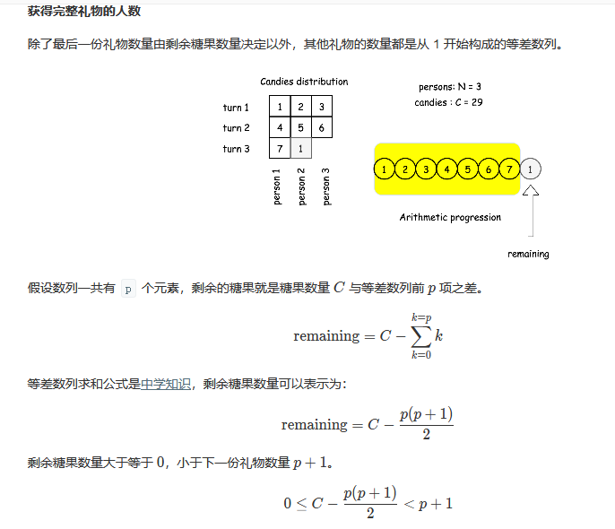
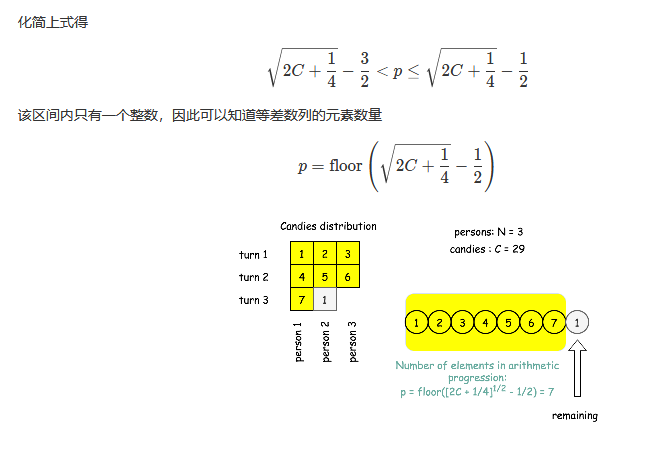
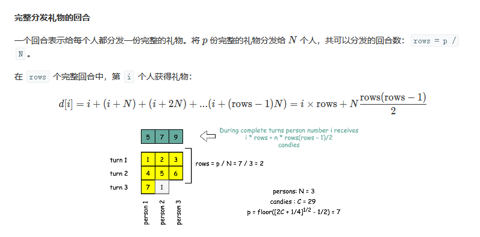
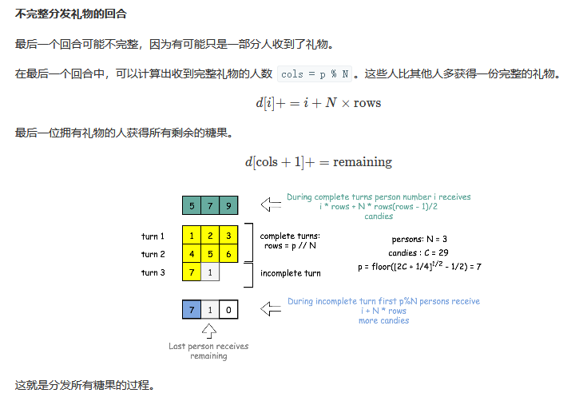
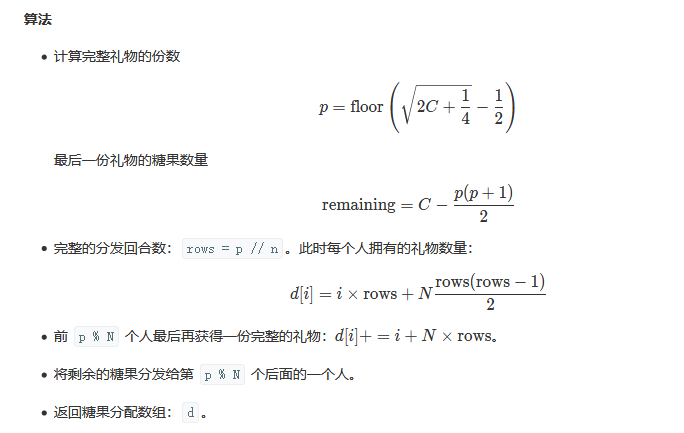

<script src="https://cdn.bootcss.com/mathjax/2.7.7/MathJax.js?config=TeX-AMS-MML_HTMLorMML"></script>

## 1103. 分糖果II (等差分糖果)

### 问题描述

排排坐，分糖果。

我们买了一些糖果 candies，打算把它们分给排好队的 n = num_people 个小朋友。

给第一个小朋友 1 颗糖果，第二个小朋友 2 颗，依此类推，直到给最后一个小朋友 n 颗糖果。

然后，我们再回到队伍的起点，给第一个小朋友 n + 1 颗糖果，第二个小朋友 n + 2 颗，依此类推，直到给最后一个小朋友 2 * n 颗糖果。

重复上述过程（每次都比上一次多给出一颗糖果，当到达队伍终点后再次从队伍起点开始），直到我们分完所有的糖果。注意，就算我们手中的剩下糖果数不够（不比前一次发出的糖果多），这些糖果也会全部发给当前的小朋友。

返回一个长度为 num_people、元素之和为 candies 的数组，以表示糖果的最终分发情况（即 ans[i] 表示第 i 个小朋友分到的糖果数）。

 

示例 1：

```
输入：candies = 7, num_people = 4
输出：[1,2,3,1]
解释：
第一次，ans[0] += 1，数组变为 [1,0,0,0]。
第二次，ans[1] += 2，数组变为 [1,2,0,0]。
第三次，ans[2] += 3，数组变为 [1,2,3,0]。
第四次，ans[3] += 1（因为此时只剩下 1 颗糖果），最终数组变为 [1,2,3,1]。
```

示例 2：

```
输入：candies = 10, num_people = 3
输出：[5,2,3]
解释：
第一次，ans[0] += 1，数组变为 [1,0,0]。
第二次，ans[1] += 2，数组变为 [1,2,0]。
第三次，ans[2] += 3，数组变为 [1,2,3]。
第四次，ans[0] += 4，最终数组变为 [5,2,3]。
```

提示：

* \\(1 \leq candies \leq 10^9\\)
* \\(1 \leq num\\_people \leq 1000\\)

来源：力扣（LeetCode）
链接：https://leetcode-cn.com/problems/distribute-candies-to-people
著作权归领扣网络所有。商业转载请联系官方授权，非商业转载请注明出处。

### 模板代码

``` java
class Solution {
    public int[] distributeCandies(int candies, int num_people) {

    }
}
```

### 解决方案

#### 1. 暴力求解



[暴力求解](qu1103/solu1/Solution.java)

#### 2. 等差数列求和












[等差数列求和](qu1103/solu2/Solution.java)
