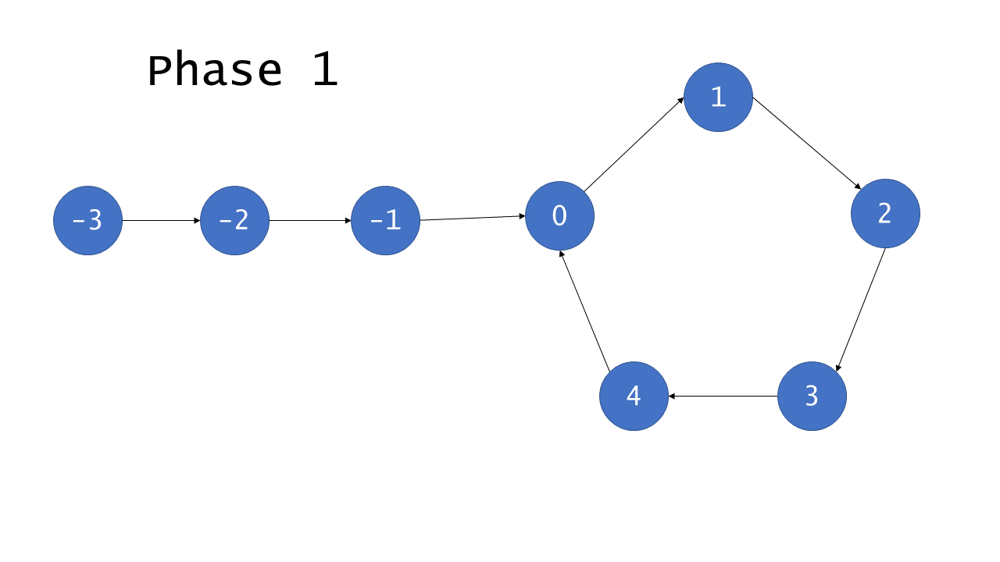

<script src="https://cdn.bootcss.com/mathjax/2.7.7/MathJax.js?config=TeX-AMS-MML_HTMLorMML"></script>

## 0141. 环形链表

[2刷](qu0141/solu/Solution.java)

### 问题描述

给定一个链表，判断链表中是否有环。

为了表示给定链表中的环，我们使用整数 pos 来表示链表尾连接到链表中的位置（索引从 0 开始）。 如果 pos 是 -1，则在该链表中没有环。

 

示例 1：

```
输入：head = [3,2,0,-4], pos = 1
输出：true
解释：链表中有一个环，其尾部连接到第二个节点。
```


示例 2：

```
输入：head = [1,2], pos = 0
输出：true
解释：链表中有一个环，其尾部连接到第一个节点。
```


示例 3：

```
输入：head = [1], pos = -1
输出：false
解释：链表中没有环。
```


进阶：

* 你能用 \\(\mathrm{O}(1)\\)（即，常量）内存解决此问题吗？

来源：力扣（LeetCode）
链接：https://leetcode-cn.com/problems/linked-list-cycle
著作权归领扣网络所有。商业转载请联系官方授权，非商业转载请注明出处。

### 模板代码

``` java
/**
 * Definition for singly-linked list.
 * class ListNode {
 *     int val;
 *     ListNode next;
 *     ListNode(int x) {
 *         val = x;
 *         next = null;
 *     }
 * }
 */
public class Solution {
    public boolean hasCycle(ListNode head) {
        
    }
}
```

### 解决方案

#### 1. 字典计数或字典缓存

检查某个节点是否已经被访问过。

时间复杂度：\\(\mathrm{O}(n)\\)。对于含有 n 个元素的链表，我们访问每个元素最多一次。添加一个结点到哈希表中只需要花费 \\(\mathrm{O}(1)\\) 的时间。

空间复杂度：\\(\mathrm{O}(n)\\)


#### 2. 快慢指针（进阶）

##### 证明快慢指针必相遇

如果有环，慢指针总会被快指针赶上并且重合。



环中的节点从 0 到 C−1 编号，其中 C 是环的长度。非环节点从 −F 到 −1 编号，其中 F 是环以外节点的数目。 **F 次迭代**以后，慢指针指向了 0 且快指针指向某个节点 h ，其中 \\(F \equiv h \pmod C \\)。这是因为快指针在 F 次迭代中遍历了 2F 个节点，且恰好有 F 个在环中。**继续迭代 C−h 次**，慢指针显然指向第 C−h 号节点，而快指针也会指向相同的节点。原因在于，快指针从 h 号节点出发遍历了 2(C−h) 个节点。

$$
\begin{aligned}
h + 2(C-h) 
&= 2C - h \\\\ 
&\equiv (C-h) \pmod C 
\end{aligned}
$$​

因此，如果列表是有环的，快指针和慢指针最后会同时指向同一个节点，因此被称为 相遇 。

作者：LeetCode
链接：https://leetcode-cn.com/problems/linked-list-cycle-ii/solution/huan-xing-lian-biao-ii-by-leetcode/
来源：力扣（LeetCode）
著作权归作者所有。商业转载请联系作者获得授权，非商业转载请注明出处。

[快慢指针](qu0141/Solution.java)

时间复杂度：\\(\mathrm{O}(n)\\)。

空间复杂度：\\(\mathrm{O}(1)\\)