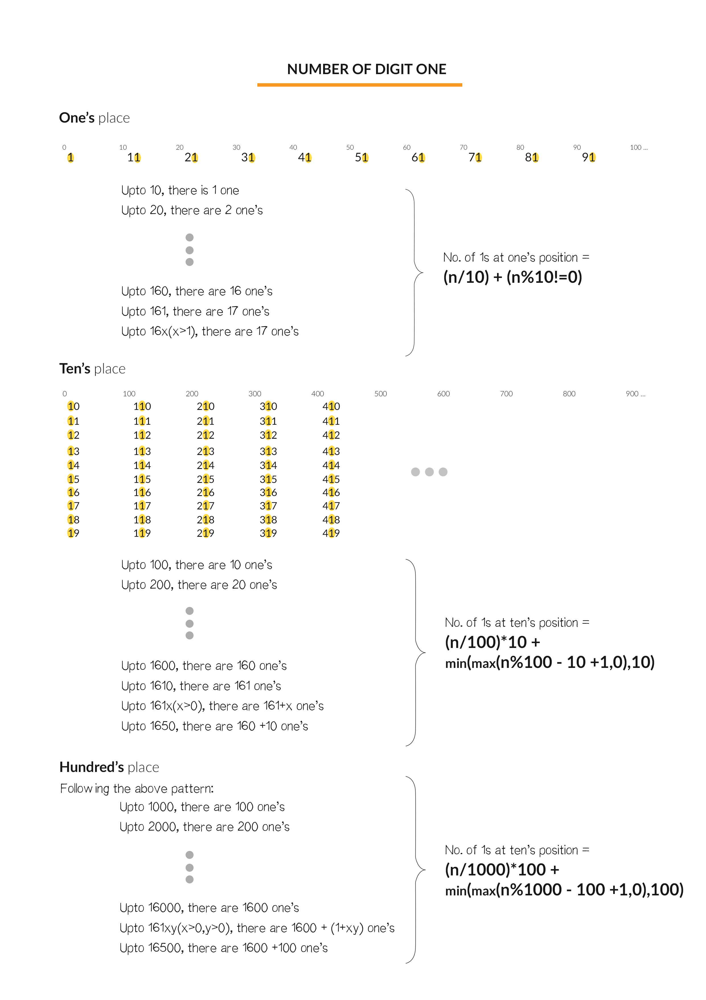

## 0233. 数字 1 的个数

<script src="https://cdn.bootcss.com/mathjax/2.7.7/MathJax.js?config=TeX-AMS-MML_HTMLorMML"></script>

[2刷](qu0233/solu/Solution.java)

### 问题描述

给定一个整数 n，计算所有小于等于 n 的非负整数中数字 1 出现的个数。

示例:

```
输入: 13
输出: 6 
```
解释: 数字 1 出现在以下数字中: 1, 10, 11, 12, 13 。


来源：力扣（LeetCode）
链接：https://leetcode-cn.com/problems/number-of-digit-one
著作权归领扣网络所有。商业转载请联系官方授权，非商业转载请注明出处。

### 模板代码

``` java
class Solution {
    public int countDigitOne(int n) {

    }
}
```

### 解决方案

#### 1. 暴力枚举（超时）

枚举 [1, n] 区间内所有数字，逐个统计。

[暴力枚举](qu0233/solu1/Solution.java)

时间复杂度：\\(O(n \cdot log_{10}(n))\\)

#### 2.数学性质（推荐）

找到 1 出现的规律，形成数学公式。



另外，还要注意溢出问题

[数学性质](qu0233/solu2/Solution.java)

时间复杂度：\\(O(log_{10}(n))\\)

时间复杂度：\\(O(1)\\)
