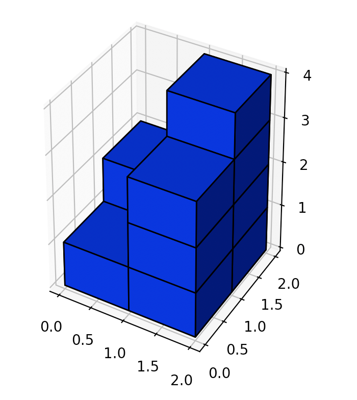

<script src="https://cdn.bootcss.com/mathjax/2.7.7/MathJax.js?config=TeX-AMS-MML_HTMLorMML"></script>

## 0892. 三维形体的表面积

### 问题描述

在 \\(N \* N\\) 的网格上，我们放置一些 \\(1 \* 1 \* 1\\)  的立方体。

每个值 \\(v = grid[i]\[j\]\\) 表示 v 个正方体叠放在对应单元格 \\((i, j)\\) 上。

请你返回最终形体的表面积。

 

示例 1：

```
输入：[[2]]
输出：10
```


示例 2：

```
输入：[[1,2],[3,4]]
输出：34
```



示例 3：

```
输入：[[1,0],[0,2]]
输出：16
```


示例 4：

```
输入：[[1,1,1],[1,0,1],[1,1,1]]
输出：32
```


示例 5：

```
输入：[[2,2,2],[2,1,2],[2,2,2]]
输出：46
```


提示：

* \\(1 \leq N \leq 50\\)
* \\(0 \leq grid[i]\[j\] \leq 50\\)

来源：力扣（LeetCode）
链接：https://leetcode-cn.com/problems/surface-area-of-3d-shapes
著作权归领扣网络所有。商业转载请联系官方授权，非商业转载请注明出处。

### 模板代码

``` java
class Solution {
    public int surfaceArea(int[][] grid) {

    }
}
```

### 解决方案

全六面，减去重叠面

[三维形体的表面积](u0892/solu1/Solution.java)