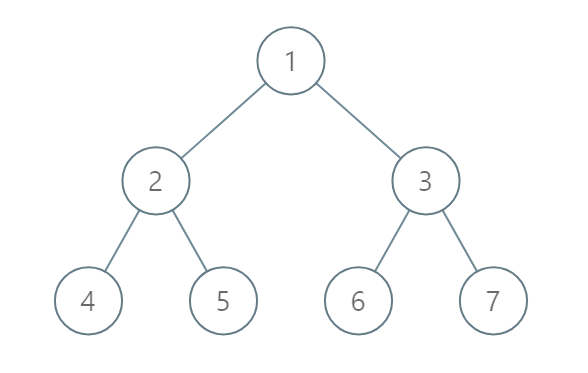

## 0987. 二叉树的垂序遍历

<script src="https://cdn.bootcss.com/mathjax/2.7.7/MathJax.js?config=TeX-AMS-MML_HTMLorMML"></script>

[2刷](qu0987/solu/Solution.java)

### 问题描述

给定二叉树，按垂序遍历返回其结点值。

对位于 (X, Y) 的每个结点而言，其左右子结点分别位于 (X-1, Y-1) 和 (X+1, Y-1)。

把一条垂线从 X = -infinity 移动到 X = +infinity ，每当该垂线与结点接触时，我们按从上到下的顺序报告结点的值（ Y 坐标递减）。

如果两个结点位置相同，则首先报告的结点值较小。

按 X 坐标顺序返回非空报告的列表。每个报告都有一个结点值列表。

 

示例 1：


```
输入：[3,9,20,null,null,15,7]
输出：[[9],[3,15],[20],[7]]
```
解释： 
在不丧失其普遍性的情况下，我们可以假设根结点位于 (0, 0)：
然后，值为 9 的结点出现在 (-1, -1)；
值为 3 和 15 的两个结点分别出现在 (0, 0) 和 (0, -2)；
值为 20 的结点出现在 (1, -1)；
值为 7 的结点出现在 (2, -2)。

示例 2：



```
输入：[1,2,3,4,5,6,7]
输出：[[4],[2],[1,5,6],[3],[7]]
```
解释：
根据给定的方案，值为 5 和 6 的两个结点出现在同一位置。
然而，在报告 "[1,5,6]" 中，结点值 5 排在前面，因为 5 小于 6。

 

提示：

* 树的结点数介于 1 和 1000 之间。
* 每个结点值介于 0 和 1000 之间。

来源：力扣（LeetCode）
链接：https://leetcode-cn.com/problems/vertical-order-traversal-of-a-binary-tree
著作权归领扣网络所有。商业转载请联系官方授权，非商业转载请注明出处。

### 模板代码

``` java
/**
 * Definition for a binary tree node.
 * public class TreeNode {
 *     int val;
 *     TreeNode left;
 *     TreeNode right;
 *     TreeNode(int x) { val = x; }
 * }
 */
class Solution {
    public List<List<Integer>> verticalTraversal(TreeNode root) {

    }
}
```

### 解决方案

#### 1. DFS记录坐标 + 排序

[DFS记录坐标 + 排序](qu0987/solu1/Solution.java)

时间复杂度：\\(\mathcal{O}(N \cdot \log N)\\)

空间复杂度：\\(\mathcal{O}(N)\\)
