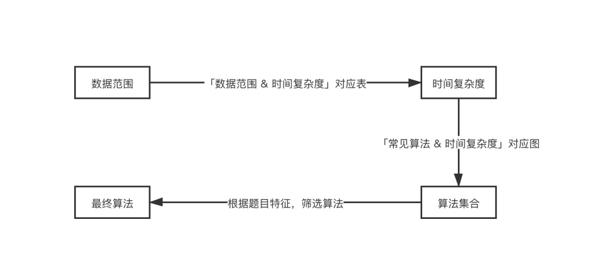
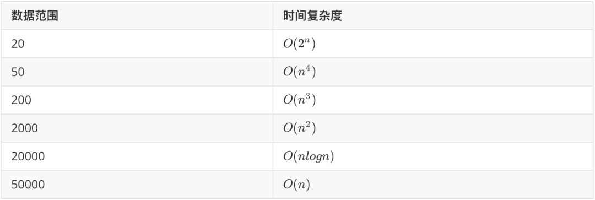
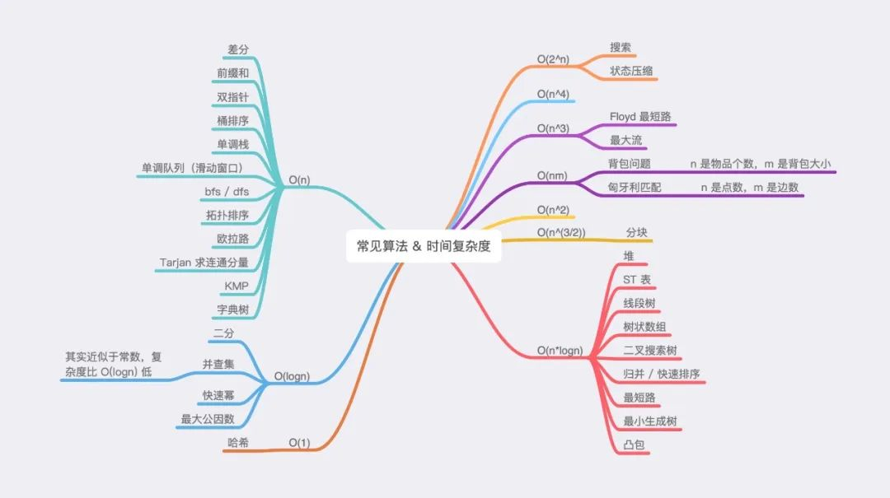

* 要把算法和编码分开来看，可以用伪代码，画图，甚至摆弄小道具的方法去寻求解法。
* 有了明确的解法，再转化成可执行的代码

## 算法答题套路

**挖掘题目特征**，根据题目特征**筛选算法**

### 数据范围

**数据范围**是一种常见的题目特征。可以根据数据范围，来限定时间复杂度。再根据时间复杂度，限定算法集合。分析题目其它特征，从算法集合中，找出最终算法。

#### 1. 数据范围 -> 时间复杂度

根据数据范围，来限定时间复杂度

通常来说，在力扣上，Python 可以支持到 \\(10^7\\) 的时间复杂度；C++ 会稍微高一点，大概 \\(10^7 - 10^8\\) 之间。因此我们可以得到如下表所示的，数据范围与算法大致时间复杂度的对应表。

#### 2. 时间复杂度 -> 常见算法

根据时间复杂度，限定算法集合

1. 上图仅列出了时间复杂度较为固定的常见算法，而类似于动态规划、贪心、暴力等时间复杂度百变多样的算法并未列出。

2. \\(\mathrm{O}(n)\\) 的算法通常与 \\(\mathrm{O}\log n)\\) 的算法组合在一起，用于实现 \\(\mathrm{O}(n \cdot \log n)\\) 要求的题目

#### 3. 题目特征 -> 最终算法

分析题目其它特征，从算法集合中，找出最终算法

